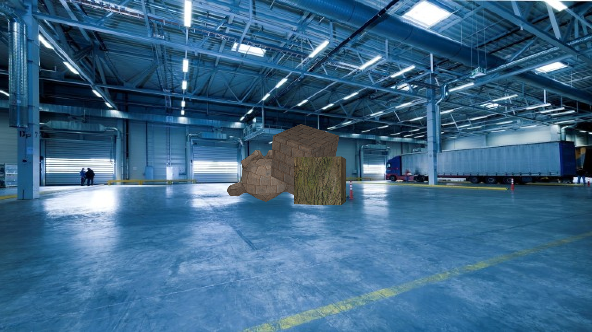

# Generating Images with Physics-Based Rendering for an Industrial Object Detection Task

This repo uses 3D-CAD models to generate synthetic training images for industrial deep-learning-based object detection tasks using Blenders ray-trace based render engine Cycles.
We generate different images by randomizing object and camera poses, lighting, background images, object texture and additional foreground objects. Additionally, we generate a JSON-file containing object detection annotations (bounding boxes) in the [COCO format](https://cocodataset.org/#format-data).

If you use this code, please cite our work:

> Eversberg, L.; Lambrecht, J. Generating Images with Physics-Based Rendering for an Industrial Object Detection Task: Realism versus Domain Randomization. Sensors 2021, 21, 7901. https://doi.org/10.3390/s21237901
>
> 

## Installation

### Building Docker

```
git clone https://github.com/CV-Bench/blender-gen.git
cd blender-gen
docker build -t blender-gen .
```

### File Structure

Set up the following folder structure (you can also use the default structure from the repo):

```
data/
    input/
        backgrounds/
            static/
                background1.jpg
                background2.jpg
            environment/
                background3.hdr
                background4.hdr
        config/
            config.json
        models/
            Robot1/
                model.obj
                Robot.mat
                SomeTexture.png
                ...
            Distractor1/
                model.obj
                Something.mat
                ...
```

### Testing Setup

Run

```
mkdir -p ./data/output
docker run --gpus all --volume "$(pwd)/data/input:/data/input" --volume "$(pwd)/data/output:/data/output" blender-gen
```

to test your setup.

## Usage

### Running Docker

```
docker run --gpus all --volume /path/to/input/folder/:/data/input --volume /path/to/output/folder/:/data/output blender-gen [--target target] [--endpoint url] [--taskID id] [--mode mode] [--coco-image-root path] [--output output]
```

#### Arguments

| argument            | type                                | default | description                                                                                                     |
| ------------------- | ----------------------------------- | ------- | --------------------------------------------------------------------------------------------------------------- |
| `--endpoint`        | url                                 |         | HTTP endpoint for sending progress, finish, and error statuses                                                  |
| `--taskID`          | string                              |         | unique ID to identify this container from inside                                                                |
| `--mode`            | `train/val/all`                     | `all`   | select which dataset parts to generate (train, val, both)                                                       |
| `--coco-image-root` | path                                | `"./"`  | Set `path` as prefix for path entries in the `annotation_coco.json` file (produces `[path]/images/[imagename]`) |
| `--target`          | `all/configure/render/merge/postfx` | `all`   | Select pipeline steps with this command. Either `all` or a comma-separated list of individual pipeline steps.   |
| `--output`          | `shell/file`                        | `shell` | Write output to `stdout`, `stderr` OR `/data/log/stdout.log`, `/data/log/stderr.log`                            |

##### endpoint

API overview for sending requests to `endpoint`:

| event          | endpoint | schema                                     |
| -------------- | -------- | ------------------------------------------ |
| merge progress | /output  | `{taskId:string, progress:int, total:int}` |
| all done       | /finish  | `{taskId:string}`                          |
| error          | /stop    | `{taskId:string}`                          |

## config.json

| Parameter                      | Description                                                                                                                                                                                                        | Example                                  |
| ------------------------------ | ------------------------------------------------------------------------------------------------------------------------------------------------------------------------------------------------------------------ | ---------------------------------------- |
| `input.object`                 | list of `{model,label,center,size,multiplicity}` objects to be recognized. `center` is an optional 3D coordinate specifying the object center. `size` is an optional number specifying the relative size (default: 1). `multiplicity` is the max number of this object per image (default: 1) | `[{model:"Suzanne", label:"Friend"}]`    |
| `input.distractor`             | list of `{model,size,multiplicity}` distractor objects. `size` and `multiplicity` same as for `object`                                                                                                             | `[{model: "EvilSuzanne"}]`               |
| `input.bg`                     | optional, list of filenames of static backgrounds in `/data/input/bg/static/` OR omit to use every image in the directory                                                                                          | `["background1.jpg", "background2.jpg"]` |
| `input.environment`            | optional, list of filenames of 360° HDRI backgrounds in `/data/input/bg/environment/`                                                                                                                              | `["background3.hdr", "background4.hdr"]` |
| `output.size_train`            | number of generated training images                                                                                                                                                                                | `100`                                    |
| `output.size_val`              | number of generated validation images                                                                                                                                                                              | `10`                                     |
| `output.just_merge`            | fraction of images that is produced by `merge.py`. ([0,1], higher number means more efficiency and less image variety)                                                                                             | `0.8`                                    |
| `output.skew_angle:material`   | proportion of angle (inc, azi) samples to material (metallic, roughness) samples                                                                                                                                   | `4`                                      |
| `render.camera.lens_unit`      | Choose either 'FOV' or 'MILLIMETERS' (https://docs.blender.org/api/current/bpy.types.Camera.html#bpy.types.Camera.lens_unit)                                                                                       | `"FOV"`                                  |
| `render.camera.lens`           | Camera lens value in chosen unit.                                                                                                                                                                                  | `75`                                     |
| `render.camera.clip_end`       | Camera far clipping distance (https://docs.blender.org/api/current/bpy.types.Camera.html)                                                                                                                          | `50`                                     |
| `render.camera.clip_start`     | Camera near clipping distance (https://docs.blender.org/api/current/bpy.types.Camera.html)                                                                                                                         | `0.01`                                   |
| `render.light.temperature`     | White light temperature in Kelvin                                                                                                                                                                                  | `1000`                                   |
| `render.light.key_inc`         | Key light inclination in °                                                                                                                                                                                         | `1000`                                   |
| `render.light.key_azi`         | Key light azimuth in °                                                                                                                                                                                             | `1000`                                   |
| `render.light.key_energy`      | Key light total energy in Joules                                                                                                                                                                                   | `1000`                                   |
| `render.light.fill_energy`     | Fill light total energy in Joules                                                                                                                                                                                  | `1000`                                   |
| `render.light.back_energy`     | Back light total energy in Joules                                                                                                                                                                                  | `1000`                                   |
| `render.resolution_x`          | Pixel resolution of the output image (width)                                                                                                                                                                       | `640`                                    |
| `render.resolution_y`          | Pixel resolution of the output image (height)                                                                                                                                                                      | `360`                                    |
| `render.compute_bbox`          | Choose _'tight'_ or _'fast'_. _Tight_ uses all vertices to compute a tight bbox but it is slower. _Fast_ uses only the 3D Bounding Box corners.                                                                    | `"tight"`                                |
| `render.use_cycles`            | Boolean. If True, cycles will be used as rendering engine. If False, Eevee will be used                                                                                                                            | `true`                                   |
| `render.samples`               | Render engine number of samples (sets cycles.samples)                                                                                                                                                              | `60`                                     |
| `render.use_cycles_denoising`  | Boolean. If True, the rendered images are denoised afterwards (https://docs.blender.org/manual/en/latest/render/cycles/render_settings/sampling.html#denoising)                                                    | `false`                                  |
| `render.use_adaptive_sampling` | Boolean. If True, adaptive sampling is used (https://docs.blender.org/manual/en/latest/render/cycles/render_settings/sampling.html#adaptive-sampling)                                                              | `false`                                  |
| `render.use_GPU`               | Boolean. If True, the GPU will be used for rendering                                                                                                                                                               | `true`                                   |
| `random.distractors`           | range for number of distractor objects per image                                                                                                                                                                   | `[0, 2]`                                 |
| `random.x_pos`                 | range for x offset (in proportion to image width)                                                                                                                                                                  | `[-0.5, 0.5]`                            |
| `random.y_pos`                 | range for y offset (in proportion to image height)                                                                                                                                                                 | `[-0.5, 0.5]`                            |
| `random.z_pos`                 | range for y offset (in proportion to camera distance. distances `<= -1` get clipped)                                                                                                                               | `[-0.2, 2]`                              |
| `random.inc`                   | range for inclination angles in °                                                                                                                                                                                  | `[0, 90]`                                |
| `random.azi`                   | range for azimuth angles in °                                                                                                                                                                                      | `[0, 90]`                                |
| `postfx.shot`                  | shot noise `{amount}`                                                                                                                                                                                              | `{amount: 0.05}`                         |
| `postfx.gaussian`              | Gaussian (defocus) blut `{radius}`                                                                                                                                                                                 | `{radius: 2}`                            |
| `postfx.motion`                | linear motion blur `{angle, length}`                                                                                                                                                                               | `{angle: 10, length:3}`                  |
| `postfx.black`                 | black noise `{mean, stdev}`                                                                                                                                                                                        | `{mean:5, stdev:1}`                      |
| `postfx.quant`                 | quantization (ADC) noise `{baseline, bits}`                                                                                                                                                                        | `{baseline:0, bits:8}`                   |

All ranges in the `random` section are 2-element list [low, high]. If a constant value is desired, a scalar can be written instead of a list.

All plug-ins in the `postfx` section have default values for everything, so individual values (or even the entire plug-in dict) are optional. Every plug-in has an optional `passthrough` boolean key, which deactivates the plug-in entirely.

## output

The output is split into `train` and `val` subdirectories inside `output`. Each subdirectory contains the following file structure:

| file                   | type      | contents                                |
| ---------------------- | --------- | --------------------------------------- |
| `images/`              | directory | output images as `[id].png`             |
| `dota/`                | directory | DOTA label for each image as `[id].txt` |
| `annotation_coco.json` | file      | COCO labels for all images              |
